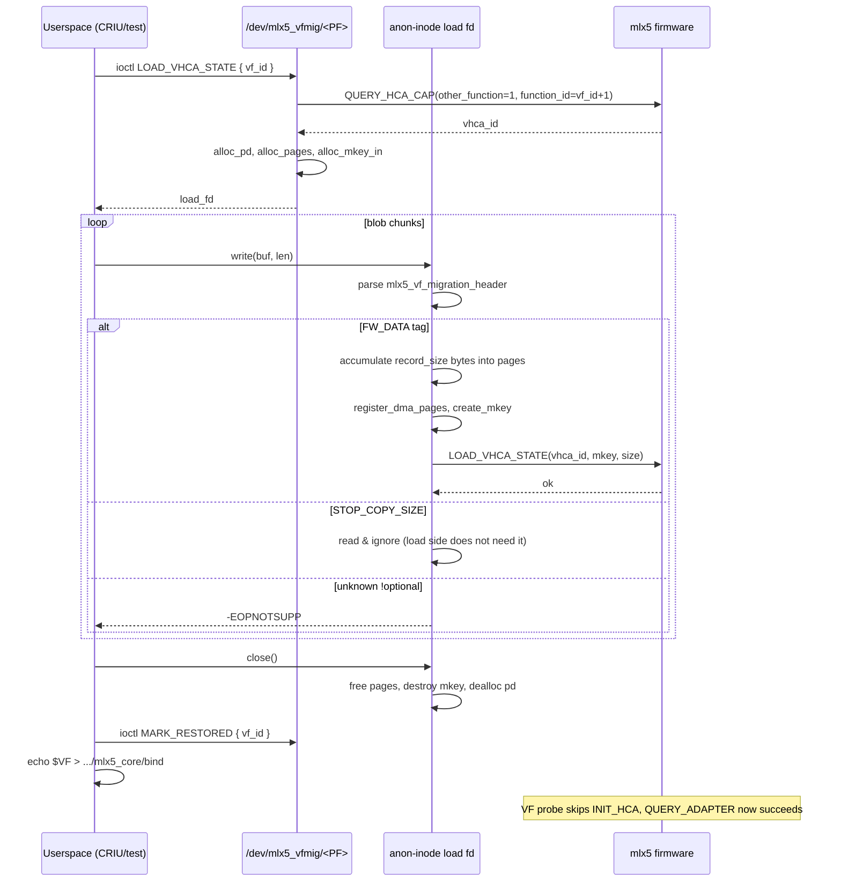

## Design summary

- **Wire format**: byte-compatible with the VFIO mlx5 framing in [drivers/vfio/pci/mlx5/cmd.h:47-52](drivers/vfio/pci/mlx5/cmd.h). Same `mlx5_vf_migration_header { __le64 record_size; __le32 flags; __le32 tag }`, same `MLX5_MIGF_HEADER_TAG_FW_DATA` / `MLX5_MIGF_HEADER_TAG_STOP_COPY_SIZE` semantics, same `MLX5_MIGF_HEADER_FLAGS_TAG_OPTIONAL` rule for unknown tags. A blob produced by `mlx5_vfio_pci`'s STOP_COPY can be written verbatim to our fd, and vice versa.
- **Transport**: ioctl returns an anon-inode write fd (`anon_inode_getfile("mlx5_vfmig_load", ...)`); userspace `write()`s the blob; on `release()` we tear down PD/MKEY/pages. This mirrors `mlx5vf_pci_resume_device_data()` in [drivers/vfio/pci/mlx5/main.c](drivers/vfio/pci/mlx5/main.c) and supports streaming/partial writes/poll naturally.
- **Restore commit is still explicit**: the LOAD fd does NOT auto-flip the `restored` bit. Userspace closes the fd, then issues the existing `MARK_RESTORED` ioctl, then binds the VF. Mirrors the M1' two-step model and lets userspace stage state across multiple LOAD sessions if it ever wants to.
- **No code lift yet**: helpers (parser, LOAD command, PD/MKEY/page registration) duplicated into `vfmig.c` from the VFIO variant driver. We mark each duplicate with a `// TODO: dedup with drivers/vfio/pci/mlx5/cmd.c:<func>` comment so a future M-late patch can hoist them.
- **vhca_id**: reuse the `restored_vhca_id` we already cache at MARK_RESTORED time -- but that's set during MARK_RESTORED, which happens after LOAD. So LOAD ioctl independently calls `vfmig_query_vhca_id(pf_mdev, vf_id+1, &vhca_id)` at fd-open time, stashes it on the load context, and uses it in `LOAD_VHCA_STATE.vhca_id`.
- **No SUSPEND/RESUME on the load path**: a fresh, never-bound VF is already in the equivalent of "stopped" from the firmware's POV (no INIT_HCA has run). The VFIO variant driver's load path also doesn't issue SUSPEND/RESUME -- those are only used in the P2P → STOP_COPY arc on the save side ([main.c:1073-1104, 1178-1180](drivers/vfio/pci/mlx5/main.c)).

## Data flow



## Files touched

### UAPI: [include/uapi/linux/mlx5_vfmig.h](include/uapi/linux/mlx5_vfmig.h)
Add one ioctl + small struct:

```c
struct mlx5_vfmig_load_state {
    __u32 vf_id;     /* in  */
    __u32 flags;     /* in  -- must be 0 for now */
    __s32 load_fd;   /* out -- anon-inode, write-only */
    __u32 reserved;
};
#define MLX5_VFMIG_IOC_LOAD_VHCA_STATE \
    _IOWR(MLX5_VFMIG_IOC_MAGIC, 0x04, struct mlx5_vfmig_load_state)
```

Comment the wire format expectation: "blob is byte-compatible with `drivers/vfio/pci/mlx5/`'s migration stream; see `struct mlx5_vf_migration_header` and `MLX5_MIGF_HEADER_TAG_FW_DATA` (those types are NOT exported to UAPI today; CRIU should treat the bytes as opaque)".

### Kernel: [drivers/net/ethernet/mellanox/mlx5/core/vfmig.c](drivers/net/ethernet/mellanox/mlx5/core/vfmig.c)

Three logical additions:

1. **Per-load context** (`struct mlx5_vfmig_load_ctx`): back-ref to `mlx5_vfmig_pf`, `vf_id`, cached `vhca_id`, `pdn`, `mkey`, `mkey_in`, `page_list`, `npages`, `dma_iova_state`, parser FSM state (`READ_HEADER` / `PREP_IMAGE` / `READ_IMAGE` / `LOAD_IMAGE` etc.), per-record bookkeeping (`record_size`, `record_tag`, `bytes_in_record`).

2. **Helpers (duplicated from VFIO variant, ~250-300 LoC)**:
    - `vfmig_alloc_pd` / `vfmig_dealloc_pd` (clones [cmd.c:859-878](drivers/vfio/pci/mlx5/cmd.c)).
    - `vfmig_alloc_pages` / `vfmig_free_pages`.
    - `vfmig_register_dma_pages` / `vfmig_create_mkey` (clones the relevant slice of [cmd.c:316-448](drivers/vfio/pci/mlx5/cmd.c)).
    - `vfmig_cmd_load_vhca_state` (clones [cmd.c:832-857](drivers/vfio/pci/mlx5/cmd.c) but takes `pf_mdev` + `vhca_id` directly, no `mvdev`).
    Each helper carries a `TODO: dedup with vfio variant` marker.

3. **Anon-inode fd + parser**:
    - `mlx5_vfmig_load_open()`: validates `vf_id`, queries vhca_id, allocates PD, returns fd via `anon_inode_getfile()`.
    - `mlx5_vfmig_load_write()`: drives the FSM (mirrors [main.c:885-969](drivers/vfio/pci/mlx5/main.c)). For each `FW_DATA` record it grows pages as needed (`MAX_LOAD_SIZE` cap, see [main.c:25](drivers/vfio/pci/mlx5/main.c)), registers MKEY, calls `vfmig_cmd_load_vhca_state(pf_mdev, vhca_id, mkey, size)`, then prepares for the next record. Optional tags (e.g. `STOP_COPY_SIZE`) are read-and-skipped. Unknown non-optional tags return `-EOPNOTSUPP`.
    - `mlx5_vfmig_load_release()`: free MKEY/pages/PD, drop `vfmig_pf` ref.
    - `mlx5_vfmig_load_fops = { .write, .release }`.
    - New ioctl handler `vfmig_ioc_load_vhca_state` plumbed into the existing dispatch alongside `MARK_RESTORED` / `GET_VHCA_ID` / `QUERY_VF`.

4. **Locking**: same model as today. `vfmig->lock` rwsem is held for read across the LOAD ioctl so the PF can't disappear between us and `device_create`/`pf_mdev` access. The fd itself takes a `kref` on `vfmig_pf` at open time (so PF unbind during a long LOAD is safe -- the load just fails with `-ENODEV` on the next firmware command).

### Userspace tool: [tools/testing/mlx5_vfmig/mlx5_vfmig.c](tools/testing/mlx5_vfmig/mlx5_vfmig.c)

Add a `load_vhca_state <vf_id> <blob_path>` verb:

- Open the cdev, ioctl `LOAD_VHCA_STATE`, get the load_fd.
- Open `<blob_path>` for read.
- `splice()` (or fall-back `read+write`) blob into load_fd.
- Close load_fd, report success.

### Test scaffold: [tools/testing/mlx5_vfmig/test_m2.sh](tools/testing/mlx5_vfmig/test_m2.sh) (new)

Two-phase test that produces the blob using the existing VFIO variant driver and consumes it via our cdev, on a single host:

1. **Save side (VFIO mlx5)**:
    - `sriov_drivers_autoprobe=1`, `sriov_numvfs=1`.
    - Bind VF to `mlx5_vfio_pci` via `driver_override`.
    - Use a tiny C helper (or `qemu-img`-style) that opens the VFIO device, sets `VFIO_DEVICE_FEATURE_MIG_DEVICE_STATE` to `STOP_COPY`, drains the data_fd into `/tmp/vf.blob`.
    - `echo $VF > /sys/bus/pci/drivers/mlx5_vfio_pci/unbind`.
    - `sriov_numvfs=0` to delete VF.

2. **Load side (our path)**:
    - `sriov_drivers_autoprobe=0`, `sriov_numvfs=1`.
    - `./mlx5_vfmig $PF load_vhca_state 0 /tmp/vf.blob` -- expect success.
    - `./mlx5_vfmig $PF mark_restored 0`.
    - `driver_override` + bind to `mlx5_core`.
    - **Acceptance**: dmesg shows `vfmig: VF (vhca_id 0x....) marked restored, skipping INIT_HCA` AND no `bad system state` errors. Probe completes; `ip link` shows the new netdev.

If we don't want to write a VFIO save helper from scratch, an even simpler bring-up: feed our LOAD fd a *trivial* synthesised blob first (one FW_DATA record with a small payload) to exercise the parser without a real save -- expect firmware to reject the contents but we'll have proven the kernel plumbing works end-to-end.

## Risks / open questions

- **MAX_LOAD_SIZE per call**: a single LOAD_VHCA_STATE has a hardware-bounded `size` field. Real-world blobs from VFIO mlx5 STOP_COPY are commonly larger -- they get split across multiple FW_DATA records (one LOAD per record), which is exactly what the FSM does. But we should confirm on hardware that the firmware accepts contiguous LOADs into the same vhca_id without a SUSPEND between them. The VFIO variant driver does (see [main.c:954-958](drivers/vfio/pci/mlx5/main.c)).
- **vhca_id stability**: when `sriov_numvfs` is dropped to 0 and recreated to 1, the destination VF gets a new `vhca_id`. So the source-side blob is *not* tied to a fixed vhca_id; the firmware embeds whatever it embeds inside the opaque payload, and the destination LOAD assigns the bytes to whatever vhca_id we pass. Worth a single empirical confirmation.
- **PD lifetime vs PF unbind**: if PF unbinds while a LOAD fd is still open, we'll fail subsequent firmware commands cleanly (`mdev` is gone), but pages allocated against that mdev's DMA mapping need to be torn down before then. Guard via `vfmig->lock` + the existing `dead` flag in `mlx5_vfmig_pf`.
- **Lifting later**: once M2 is working, a follow-up patch should hoist `mlx5_core_alloc_pd`/`dealloc_pd` users, the MKEY plumbing, and the LOAD/SAVE/SUSPEND/RESUME wrappers into mlx5_core proper, then have `drivers/vfio/pci/mlx5/cmd.c` consume them. Out of scope for M2.
- **No SAVE side in M2**: by design. We rely on VFIO mlx5 (or, eventually, an M3 SAVE ioctl on our cdev) to produce the blob. Adding our own SAVE has more surface (workqueue, MKEY callback, async completion) and isn't needed to validate the LOAD path.

## Acceptance criteria for M2

1. `MLX5_VFMIG_IOC_LOAD_VHCA_STATE` returns a writable anon-inode fd.
2. Writing a VFIO-mlx5-produced blob to that fd succeeds and emits at least one `LOAD_VHCA_STATE` firmware command per FW_DATA record.
3. After LOAD + MARK_RESTORED + bind, the previously seen `QUERY_ADAPTER ... bad system state (0x4)` is gone; `mlx5_init_one` runs to completion.
4. The `mlx5_core_dev` object (and any subsequent `mlx5_ib` aux probe, if it auto-attaches) is healthy enough that basic device sysfs (`/sys/class/infiniband/mlx5_X` or `/sys/class/net/...`) appears.
5. Closing the LOAD fd without writing anything is a no-op (no firmware command issued, no leak).